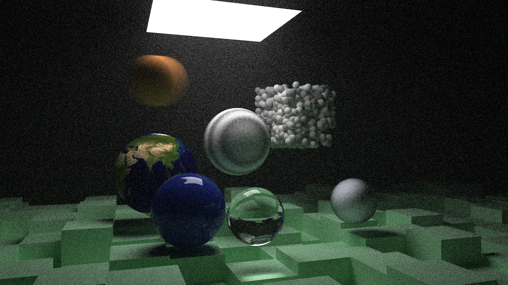
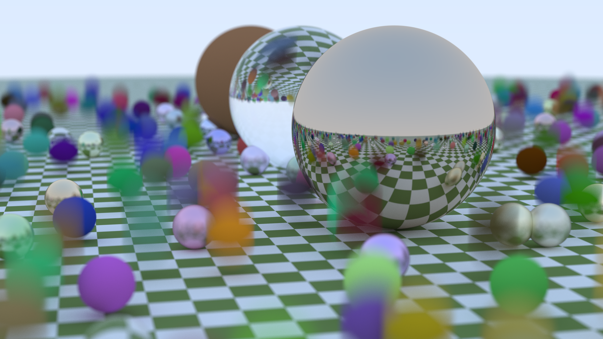
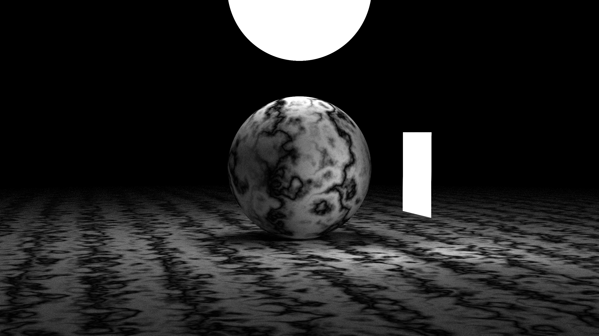
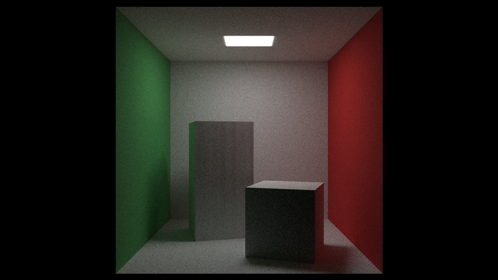
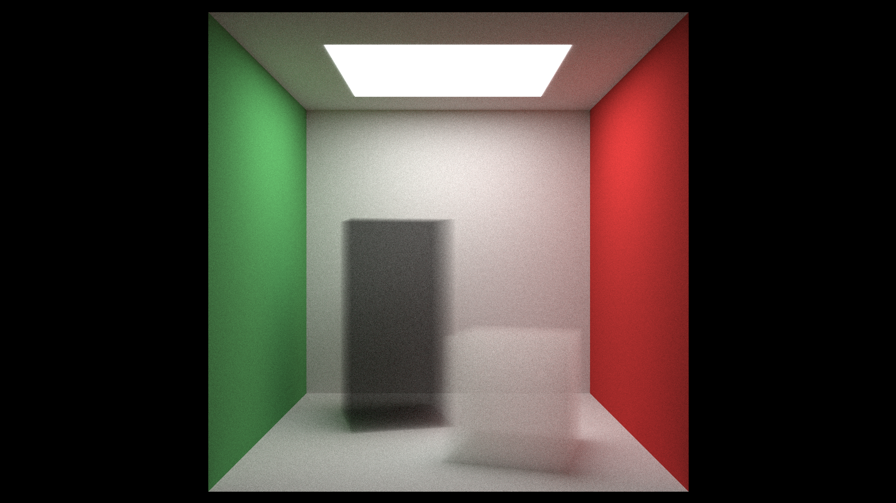

This project is a Slang shader implementation of  _Ray Tracing The Next Week_. 

https://github.com/RayTracing/raytracing.github.io

== The output

== Build

To use vcpkg manifest mode, remove .bak extension from vcpkg*.bak files.
[source]
----
cmake --preset ninja
cmake --build build
----

or to use double on shader,
[source]
----
cmake --preset ninja-double
cmake --build build
----

executable under build/app1

== Design Choices

Creating the hittable list is too expensive on shader; cpu creates and uploads with SSBO.
The related code is in `populateWorld()` and `createBuffers()`.

Pointer and polymorphism is limited on shader; pointer is substituted with index of SSBO.

To maintain similarity to polymorphic hittables, materials, and textures, SSBO is an array of tagged union. 
However, shader does not support `union`, so it is mimicked with Slang's reinterpret<T>.

On BVH traversal, the hit() needs access to SSBO. Rather than passing around SSBO handle, the traversal happens on only on global hit().

From Book 2 implementation, C++ code is added for CPU, because BVH construction happens on CPU side. Mostly preserves the original code.

Instead of each hittable's constructor, there is a builder for it. Without builder, bbox on constructor requires unpacking to reach bbox on polymorphism.

Just used Vulkan for texture sampler, instead of uploading pixel SSBO to shader.

`Translation` and `Rotation` are uploaded like all hittables. Because function recursion is impossible, local_ray and local_to_world transformation are stored and accumulated per iteration. 
HittableList is added; bvh node, hittable list, and transformations push stack entry.

`ConstantMedium` implementation required two hit records, enter and exit. To maintain generality, and not to further complicate global hit(), I just copied hit() into ConstantMedium with limited functionalities.

== Help

I only tested code on Linux and Nvidia GPU. I would be grateful to know errors on other platforms.

== License

This project is licensed as
https://creativecommons.org/publicdomain/zero/1.0/[CC0 1.0 Universal]
